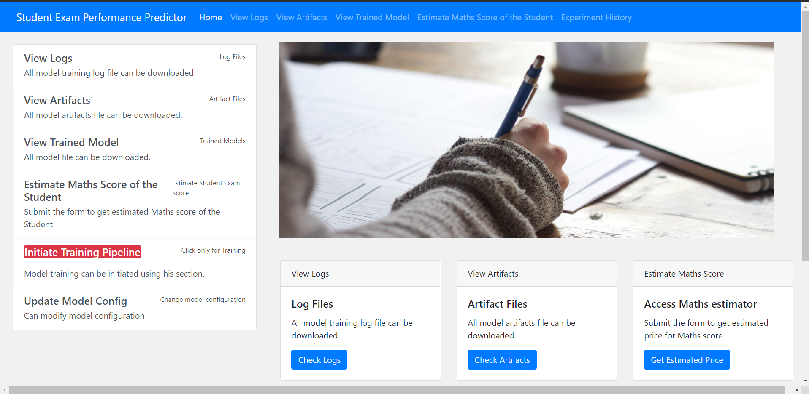
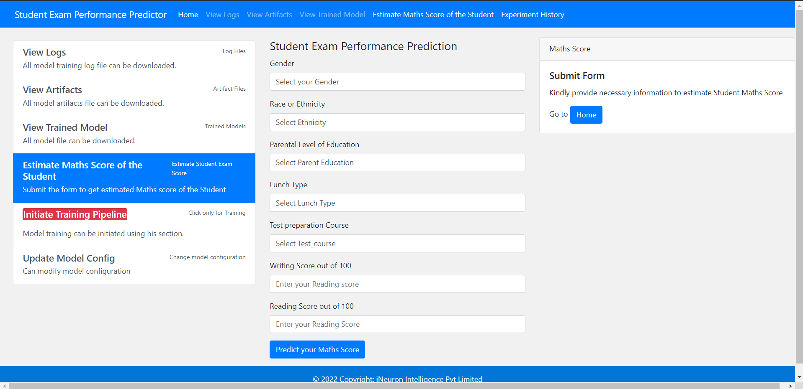
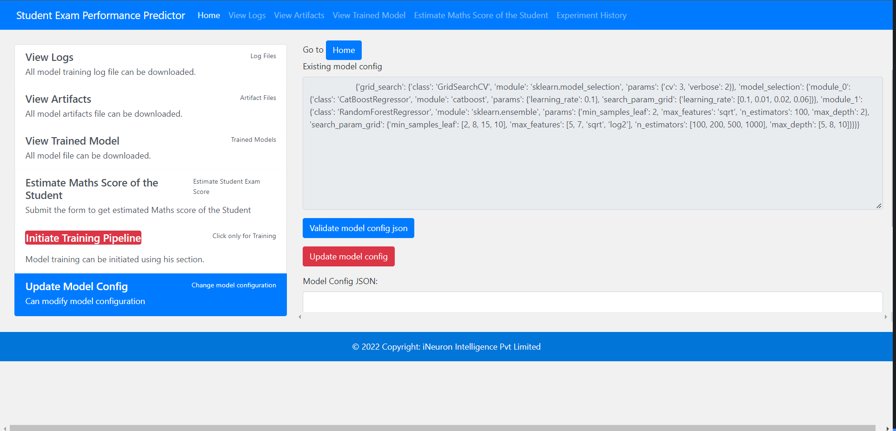
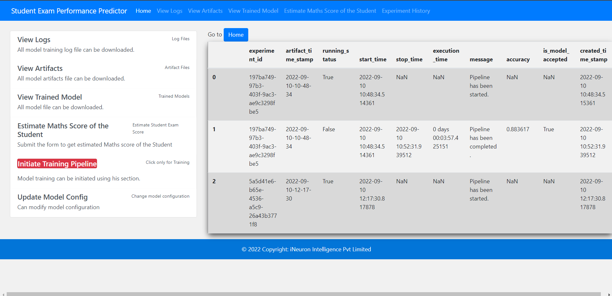

# 📄✏ Student-Exam-Performance-Predictor
This project aims to solve the problem of Classes in School of predicting the outcome of students in the Final exams. Using Sklearn's supervised machine learning techniques. It is a regression problem and predictions are carried out on dataset of classroom students with their bio-data with reading and writing score to predict the Maths score of a particular student. Several regression techniques have been studied, including XGboost and Random forests of decision trees are used in the Project.

For Detailed EDA and Feature engineering Check out notebook directory 

Their performances were compared in order to determine which one works best with our dataset and used them to predict the Maths score of a particular student from user input from Flask application.

#### Dataset is taken from Kaggle and stored in github as well as inside notebook directory 


## Features in Datasets:
1. Gender: Student's gender ('Male', 'Female') [str]
2. race/ethnicity : Ethnicity of students -> (Group A, B,C, D,E) [str]
3. parental level of education :  parents' final education ->(bachelor's degree,some college,master's degree,associate's degree,high school)[str]
4. lunch :having lunch before test (standard or free/reduced). [str]
5. test preparation course : complete or not complete before test [str]
6. math score [int]
7. reading score[int]
8. writing score[int]

💿 Installing
1. Environment setup.
```
conda create -n student python==3.9 -y
```
```
conda activate student
````
2. Install Requirements and setup
```
pip install -r requirements.txt
```
5. Run Application
```
python app.py
```

🔧 Built with
- Flask
- Python 3.9
- Machine learning
- Scikit learn
- 🏦 Industrial Use Cases

## Work flows

* config.yaml after constant
* config_entity
* artifact_entity
* update the configuration manager in config
* component
*pipeline
* app.py / demo.py

## Models Used
* Linear Regression
* Lasso Regression
* Ridge Regression
* K-Neighbors Regressor
* Decision Tree
* Random Forest Regressor
* XGBRegressor
* CatBoosting Regressor
* AdaBoost Regressor

From these above models after hyperparameter optimization we selected Top two models which were XGBRegressor and Random Forest Regressors and used the following in Pipeline.

* GridSearchCV is used for Hyperparameter Optimization in the pipeline.

* Any modification has to be done in  Inside Config.yaml which can be done in route **/update_model_config**

## `student` is the main package folder which contains 

**Artifact** : Stores all artifacts created from running the application

**Components** : Contains all components of Machine Learning Project
- DataIngestion
- DataValidation
- DataTransformations
- ModelTrainer
- ModelEvaluation
- ModelPusher

**Custom Logger and Exceptions** are used in the Project for better debugging purposes.

## 📷 Application Screenshots
### **This is the screenshot of the final Webpage which was done using the Flask**


### **This is the screenshot of the webpage which gets user input for prediction**



### **This is the screenshot of the page in which user can change the model parameters for the experiment**


### **This is the screenshot of the page where u can check the experiment history**


## Conclusion
- This Project can be used in real-life by Students or Teachers to Predict the Maths score based on the inputs.
- Can be implemented in school website to predict the Score before exam so that institution can be informed about the score and improve based on the results.

=======